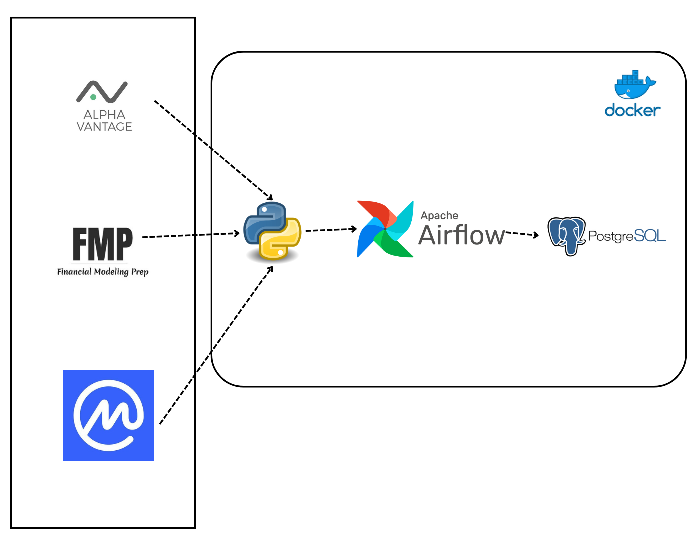

[](https://www.postgresql.org/)
[](https://www.python.org/downloads/)


# MarketPipe

<p align="center">
    
</p>

<p align="center">
    <a href="https://github.com/abeltavares/postql">
        
    </a>
    <a href="https://pypi.org/project/PostQL/">
        
    </a>
    <a href="https://opensource.org/licenses/MIT">
        
    </a>
</p>

<br>


Containerized Apache Airflow etl pipeline for collecting and storing stock and cryptocurrency market data following object-oriented programming and unit testing framework.

## 🏛 Architecture

Below is the default architecture diagram of the MarketPipe system, illustrating the flow of data from source to storage:



## 🌟 Features

- **Dynamic Data Source Integration**: Extend and customize by plugging in new data sources with ease. Just drop in a module, and you're set!
- **Automated Data Workflows**: Let Airflow do the heavy lifting with scheduled data collection, so you can focus on making strategic decisions.
- **Containerized from the Start**: Dockerized setup means you get up and running in no time, maintaining consistency across all environments.
- **User-Centric Configuration**: Tailor everything via `mdp_config.json` to fit your unique needs, whether it’s tweaking the assets or adjusting the schedule.
- **Built-In Security**: We take security seriously, so you're covered from the ground up with best practices in secure data handling.
- **Design by Contract with Pysertive**: We use the [Pysertive](https://github.com/abeltavares/pysertive) library to enforce and invariants in our code. This ensures that stocks and cryptos are provided in the configuration file, enhancing the robustness and reliability of our application.


## 🧩 Project Components

MarketPipe is structured with clarity and modularity in mind. Here's what you'll find inside:

```plaintext
MarketTrackPipe/
├── core/                              # The heart of MarketTrackPipe's logic
│   ├── base_api.py                    # Defines the BaseApiClient abstract base class and ApiClientFactory
│   ├── crypto_api_client.py           # Retrieves cryptocurrency data
│   ├── data_processor.py              # Orchestrates the data retrieval and storage
│   ├── __init__.py                    # Marks the directory as a Python package
│   ├── stock_api_client.py            # Retrieves stock market data
│   └── storage.py                     # Manages the storage of market data
├── custom/                            # A place for custom extensions and modules
│   ├── __init__.py                    # Marks the directory as a Python package
│   └── stock_api_client.py            # Custom stock API client
├── dags/                              # Contains the Airflow DAG definitions
│   └── market_data_dag.py             # Defines the DAG for processing market data
├── database_setup/                    # SQL scripts for database initialization
│   └── init.sql                       # SQL script for initializing the database
├── docker/                            # Dockerfiles for container setup
│   ├── airflow/
│   │   ├── Dockerfile                 # Dockerfile for the Airflow service
│   │   └── requirements.txt           # Python dependencies for the Airflow service
├── docker-compose.yaml                # Docker Compose configuration for services
├── mdp_config.json                    # Configuration file for the pipeline
├── requirements.txt                   # Python dependencies for the entire project
├── tests/                             # Test cases for the application's components
│   ├── dags_test.py                   # Tests for the Airflow DAGs
│   ├── test_crypto_api_client.py      # Tests for the CryptoApiClient class
│   ├── test_stock_api_client.py       # Tests for the StockApiClient class
│   ├── test_base_api_client.py        # Tests for the BaseApiClient class (to be done)
│   ├── test_data_processor.py         # Tests for the DataProcessor class (to be done)
│   └── test_storage.py                # Tests for the Storage class
└── utils/                             # Utility functions and helper scripts
    ├── __init__.py
    └── market_data_processor_utils.py  # Utility functions for the MarketTrackPipe
```
### Core

The `core` directory is where the main logic of the project resides:

- `base_api.py`: Hosts the `BaseApiClient` abstract base class that serves as the foundation for all API clients. It also contains the `ApiClientFactory` for creating instances of API clients dynamically.
- `crypto_api_client.py`: Implements the `CryptoApiClient` class, inheriting from `BaseApiClient` and fetching cryptocurrency data using the CoinMarketCap API.
- `data_processor.py`: The `DataProcessor` class within orchestrates the retrieval and storage of market data, coordinating between API clients and storage mechanisms.
- `stock_api_client.py`: The `StockApiClient` class, also inheriting from `BaseApiClient`, pulls stock data from APIs such as Alpha Vantage and Financial Modeling Prep.
- `storage.py`: The `Storage` class handles all interactions with the database, ensuring market data is stored reliably and efficiently.

### Custom

The `custom` directory is designed to house custom user-defined modules:

- Place any custom API client modules here, and they will be dynamically loaded into MarketPipe based on your `mdp_config.json` settings.

   *Note*: Any custom API client must inherit from the `BaseApiClient` class.

### DAGs

In the `dags` directory, you'll find Airflow DAGs that define the project's workflow automation:

- `market_data_dag.py`: Contains the DAG definition for orchestrating the market data collection and storage processes.

### Database Setup

The `database_setup` directory has the SQL scripts needed to get your database up and ready:

- `init.sql`: This initialization script sets up the database schema, creating the necessary tables and relationships for MarketPipe.

### Docker

The `docker` directory includes Dockerfiles and related configurations for building the project's containers:

- `airflow/Dockerfile`: Defines the Airflow service's container, specifying the required Python environment and dependencies.
- `airflow/requirements.txt`: Lists all Python packages needed by the Airflow service.

### Docker Compose

The `docker-compose.yaml` file orchestrates the setup of all related services, ensuring that each container is configured correctly and linked properly for the pipeline to function.

### Tests

The `tests` directory provides a suite of unit tests that ensure each component of MarketPipe is functioning as expected:

- `dags_test.py`: Tests the Airflow DAGs to verify that they execute without errors.
- `test_data_processor.py`: Validates the `DataProcessor` class and ensures data is processed accurately. (to be done)
- `test_base_api_client.py`: Tests the `BaseApiClient` abstract base class to ensure it functions as expected. (to be done)
- `test_stock_api_client.py`: Tests the `StockApiClient` class to ensure it retrieves stock data correctly.
- `test_crypto_api_client.py`: Tests the `CryptoApiClient` class to ensure it retrieves cryptocurrency data correctly.

### Utils

The `utils` directory contains helper scripts and utility functions that aid various aspects of the pipeline:

- `market_data_processor_utils.py`: Offers utility functions for common data processing tasks within MarketPipe.

By understanding each component and how they fit into the MarketPipe ecosystem, contributors can effectively navigate the project and add value through their enhancements and features.


✔️ Requirements
---------------

- [Docker](https://www.docker.com/get-started)
- [pre-commit](https://pre-commit.com/) (Developer)


🚀 Setup
---------------

1. Clone the repository:

   ```bash
    git clone https://github.com/abeltavares/marketpipe.git
   ```

2. Environment Setup:

- Configure your `.env` from `.env.example`.

3. Fire It Up:

   ```bash
    docker-compose up
   ```

🚀 Installation
---------------

After setting up the workflow, you can access the Apache Airflow web UI to monitor the status of the tasks and the overall workflow.

To access the data stored in the PostgreSQL database you can go with:

**Command-line tool `psql`**: You can use `psql` to run SQL queries directly. Find the database credentials and connection information in the '.env' file. Use the following command in your terminal to connect to the database:

   ```bash
    docker exec -it [host] psql -U [user] -d market_data  
   ```


⚙ Configuration
---------------

Make it yours by tweaking the `mdp_config.json`:

```json
{
    "owner": "airflow",
    "email_on_failure": false,
    "email_on_retry":  false,
    "retries": 0,
    "clients": {
        "stocks": {
            "module": "core.stock_api_client",
            "class": "StockApiClient"
        },
        "cryptos":{
            "module": "core.crypto_api_client",
            "class": "CryptoApiClient"
        }
    },
    "assets": {
        "stocks": {
            "symbols": [
                "AAPL",
                "GOOG",
                "MSFT"
            ],
            "schedule_interval": "29 22 * * *"
        },
        "cryptos": {
            "symbols": [
                "BTC",
                "ETH"
            ],
            "schedule_interval": "29 22 * * *"
        }
    }
}

```

To add a new API client:

1.  Create a new Python file under the `custom/` directory.
2.  Implement an API client class extending `BaseApiClient`.
3.  Update `mdp_config.json` to register your new client class.


🌱 Future Work
--------------

-   Front-End Dashboard: 
Developing a sleek, user-friendly dashboard to visualize data trends and insights.
-   Broader Data Source Support: 
Expanding beyond financial data into other use cases.
- Cloud Infrastructure Integration:
Integrate cloud infrastructure provisioning. 

- Advanced Data Storage Solutions:
Integrate ingestion of data into configurable lakes and data warehouses.

## TODO

- [ ] Add tests for the DataProcessor class
- [ ] Add tests for the BaseApiClient class

🤝 Contributing
--------------

This project is open to contributions. If you have any suggestions or improvements, please feel free to create a pull request.

The codebase of this project follows the [black](https://github.com/psf/black) code style. To ensure consistent formatting, the [pre-commit](https://pre-commit.com/) hook is set up to run the black formatter before each commit.

Additionally, a GitHub Action is configured to automatically run the black formatter on every pull request, ensuring that the codebase remains formatted correctly.

Please make sure to run `pip install pre-commit` and `pre-commit install` as mentioned in the setup instructions to enable the pre-commit hook on your local development environment.

Contributors are encouraged to follow the black code style guidelines when making changes to the codebase.

Please make sure to check out our [Contribution Guidelines](CONTRIBUTING.md) before making a pull request.

📜 License
--------------

This project is licensed under the [MIT License](LICENSE.txt).
