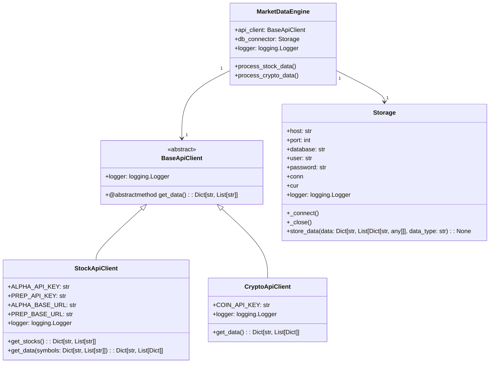
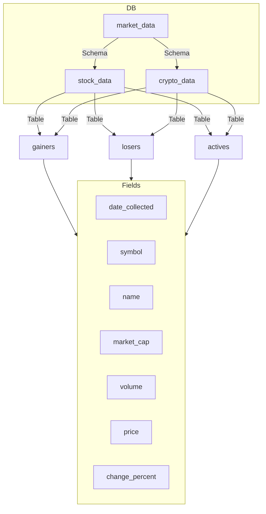
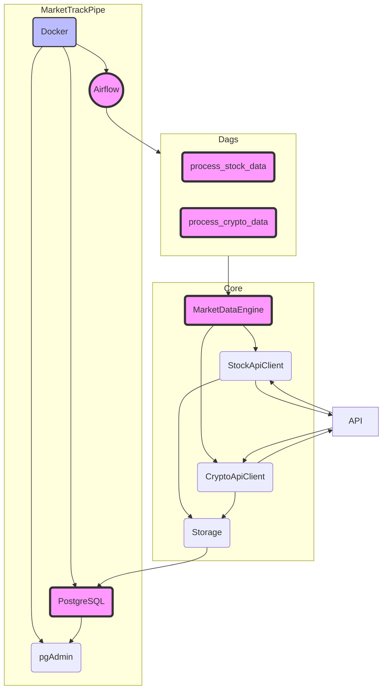

[](https://www.postgresql.org/)
[](https://www.python.org/downloads/)


# MarketTrackPipe

MarketTrackPipe is an automated Apache Airflow data pipeline for collecting and storing stock and cryptocurrency market data. The pipeline retrieves daily data for the top 5 stocks and top 5 cryptocurrencies based on market performance from Alpha Vantage, Financial Modeling Prep, and CoinMarketCap APIs and stores it in a PostgreSQL database. The pipeline is containerized using Docker and written in Python 3.

The pipeline follows object-oriented programming principles to ensure modularity, maintainability, and extensibility. Each component of the pipeline is designed as a separate class with well-defined responsibilities.

Unit testing is implemented throughout the workflow to ensure the reliability and efficiency of the pipeline. These tests validate the functionality of each component and help identify any potential issues or bugs.

## Project Components


```
   ├── core
   │   ├── __init__.py
   │   └── market_data_processor.py
   ├── dags
   │   └── market_data_dag.py
   ├── docker-compose.yaml
   ├── init.sql
   └── tests
      ├── dags_test.py
      └── tests_market_data_processor.py
```

- `core`: Contains core functionality for processing market data.

<br>

- `dags`: Contains the Apache Airflow DAG definitions for orchestrating the data collection and storage process.
- `tests`: Contains the unit tests for testing individual components of the project.
- `init.sql`: SQL script for creating and initializing the database schema.

<br>

- `docker-compose.yml`: Defines the services and configures the project's containers, setting up the environment (postgres, pgadmin, airflow).

The `MarketDataEngine` class within `core/market_data_processor.py` encapsulates the logic for retrieving and storing market data. The `market_data_dag.py` file within the `dags` directory sets up the Apache Airflow DAGs for collecting and storing market data.
<br>


## Requirements

- [Docker](https://www.docker.com/get-started)
- [pre-commit](https://pre-commit.com/) (Developer)


## Setup

1. Clone the repository:

   ```bash
    git clone https://github.com/abeltavares/MarketTrackPipe.git
   ```

2. Create an '.env' file in the project's root directory with the required environment variables (refer to the example .env file in the project).

3. Start the Docker containers:

   ```bash
    docker-compose up
   ```

4. Access the Airflow web server:

   Go to the Airflow web UI at http://localhost:8080 and turn on the DAGs.

   Alternatively, you can trigger the DAG manually by running the following command in your terminal:

   ```bash
    airflow trigger_dag data_collection_storage_stocks
    airflow trigger_dag data_collection_storage_crypto
   ```

## Setting up Pre-commit Hooks (Developer Setup)

To ensure code quality and run unit tests before committing changes, MarketTrackPipe uses [pre-commit](https://pre-commit.com/) hooks. Follow these steps to set it up:

1. Install `pre-commit` by running the following command in your terminal:

   ```bash
    pip install pre-commit
   ```

2. Run the following command to set up pre-commit:

   ```bash
    pre-commit install
   ```
   
   This will install the pre-commit hook into your git repository.
<br>

3. Now, every time you commit changes, pre-commit will automatically run unit tests to ensure code quality. Additionally, these tests are also executed in a GitHub Actions workflow on every pull request to the repository.

## Usage

After setting up the workflow, you can access the Apache Airflow web UI to monitor the status of the tasks and the overall workflow.

To access the data stored in the PostgreSQL database, you have two options:

1. **Command-line tool `psql`**: You can use `psql` to run SQL queries directly. Find the database credentials and connection information in the '.env' file. Use the following command in your terminal to connect to the database:

   ```bash
    docker exec -it [host] psql -U [user] -d market_data  
   ```
2. Use `pgAdmin`, a web-based visual interface. To access it, navigate to http://localhost:5050 in your web browser and log in using the credentials defined in the `.env` file in the project root directory. From there, you can interactively browse the tables created by the pipeline, run queries, and extract the desired data for analysis or visualization.

Choose the option that suits you best depending on your familiarity with SQL and preference for a graphical or command-line interface.

## Acknowledgments 

The APIs used in this project are provided by [Alpha Vantage](https://www.alphavantage.co/documentation/), [Financial Modeling Prep](https://financialmodelingprep.com/developer/docs/), and [CoinMarketCap](https://coinmarketcap.com/api/documentation/v1/). Please refer to their documentation for more information on their APIs.


## Contributions

This project is open to contributions. If you have any suggestions or improvements, please feel free to create a pull request.

## Copyright
© 2023 Abel Tavares


The codebase of this project follows the [black](https://github.com/psf/black) code style. To ensure consistent formatting, the [pre-commit](https://pre-commit.com/) hook is set up to run the black formatter before each commit.

Additionally, a GitHub Action is configured to automatically run the black formatter on every pull request, ensuring that the codebase remains formatted correctly.

Please make sure to run `pip install pre-commit` and `pre-commit install` as mentioned in the setup instructions to enable the pre-commit hook on your local development environment.

Contributors are encouraged to follow the black code style guidelines when making changes to the codebase.
